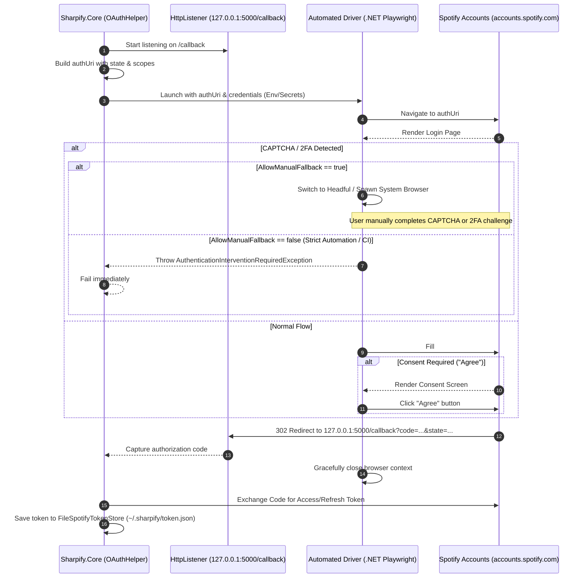

# Sharpify

A modern, extensible .NET Spotify Web API client library built on **.NET 10**.

## Features

- **Typed HTTP Client**: Built around `IHttpClientFactory` and `HttpClient` best practices.
- **Resilient Token Management**: Automatic authentication and renewal using the Spotify Client Credentials flow.
- **Options Pattern**: Strongly typed `SpotifyClientOptions` with startup validation (`ValidateDataAnnotations()` and `ValidateOnStart()`).
- **Clean Architecture**:
  - `src/Sharpify.Core`: Core library containing client interfaces, models, options, and request builders.
  - `src/Sharpify.App`: Host/CLI runner for development, testing, and sample usage.
  - `tests/Sharpify.Tests`: Test suite covering client functionality.

---

## Getting Started

### Prerequisites

- [.NET 10 SDK](https://dotnet.microsoft.com/download)
- Spotify Developer Account: Ensure `http://127.0.0.1:5000/callback` is added to your app's **Redirect URIs** in the [Spotify Developer Dashboard](https://developer.spotify.com/dashboard).

### Building and Testing

```bash
# Restore and build the entire solution
dotnet build

# Run unit tests
dotnet test
```

---

## Configuration

`Sharpify` uses the standard .NET configuration system. For local development, configure your Spotify Developer credentials using .NET User Secrets:

```bash
dotnet user-secrets set "SpotifyClient:ClientId" "<your-spotify-client-id>" --project src/Sharpify.App
dotnet user-secrets set "SpotifyClient:ClientSecret" "<your-spotify-client-secret>" --project src/Sharpify.App
```

Or configure them in `appsettings.Development.json`:

```json
{
  "SpotifyClient": {
    "ClientBaseUrl": "https://api.spotify.com/v1",
    "UserAccountUrl": "https://accounts.spotify.com/api/token",
    "AuthorizeUrl": "https://accounts.spotify.com/authorize",
    "RedirectUri": "http://127.0.0.1:5000/callback",
    "ClientId": "<your-spotify-client-id>",
    "ClientSecret": "<your-spotify-client-secret>"
  }
}
```

---

## Dependency Injection & Usage

### 1. Register Services

```csharp
using Microsoft.Extensions.DependencyInjection;
using Microsoft.Extensions.Options;
using Sharpify.Core.Authentication;
using Sharpify.Core.Clients;

// Bind and validate options
builder.Services
    .AddOptions<SpotifyClientOptions>()
    .Bind(builder.Configuration.GetSection(SpotifyClientOptions.SectionName))
    .ValidateDataAnnotations()
    .ValidateOnStart();

// Register token store & authentication service
builder.Services.AddSingleton<ISpotifyTokenStore, FileSpotifyTokenStore>();
builder.Services.AddHttpClient<ISpotifyAuthService, SpotifyAuthService>();

// Register typed client
builder.Services.AddHttpClient<SpotifyClient>((serviceProvider, httpClient) =>
{
    var options = serviceProvider.GetRequiredService<IOptions<SpotifyClientOptions>>().Value;
    httpClient.BaseAddress = new Uri(options.ClientBaseUrl.TrimEnd('/') + "/");
});
```

### 2. Authenticate & Query Playlists

```csharp
using Sharpify.Core.Authentication;
using Sharpify.Core.Clients;

// 1. One-time interactive user login (cached to ~/.sharpify/token.json for future runs)
await SpotifyOAuthHelper.LoginAsync(authService, tokenStore, options.RedirectUri);

// 2. Fetch playlist items (tracks)
var playlist = await spotifyClient.GetPlaylistItemsAsync("0vvXsWCC9xrXsKd4FyS8kM");

foreach (var item in playlist.Items)
{
    Console.WriteLine($"🎵 {item.Track?.Name} - {item.Track?.Artists[0]?.Name}");
}
```

### 2. Inject and Query

```csharp
using Sharpify.Core.Clients;
using Sharpify.Core.Requests;
using Sharpify.Core.Responses;

public class MySpotifyService(SpotifyClient client)
{
    public async Task FetchItemsAsync(CancellationToken ct = default)
    {
        var request = new SpotifyRequest("playlists/{playlist_id}/tracks");
        var items = await client.GetPlaylistItemsAsync(request, ct);
        
        foreach (var item in items.Items)
        {
            Console.WriteLine(item.Track?.Name);
        }
    }
}
```

---

## Roadmap & Planned Features

### 🚧 Automated Headless Spotify OAuth Authentication

> [!NOTE]
> **Status:** Under Research & Design (Planned / Work Required — Not Yet Implemented).
>
> Tracked in RFC specification: [docs/rfcs/001-automated-oauth-authentication.md](docs/rfcs/001-automated-oauth-authentication.md).

Currently, Sharpify uses the interactive OAuth 2.0 Authorization Code flow requiring user login via a system browser window. We are designing a zero-touch automated login driver (primarily targeting developer CLI convenience with adaptability for headless CI/CD) using `Microsoft.Playwright` (with fallback to external scripting runtimes if bot challenges require it).

#### Target Authentication Flow



---

## Project Structure

```text
├── Sharpify.slnx                       # Solution file
├── global.json                         # .NET SDK pin
├── src/
│   ├── Sharpify.Core/                  # Class Library
│   │   ├── Clients/                    # SpotifyClient & options
│   │   ├── Requests/                   # Request definitions
│   │   └── Responses/                  # Response DTOs
│   └── Sharpify.App/                   # Console host application
└── tests/
    └── Sharpify.Tests/                 # Unit test suite
```
