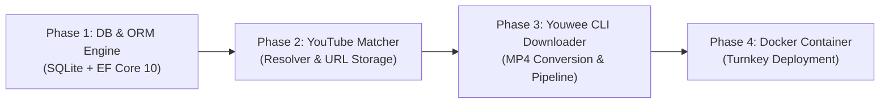
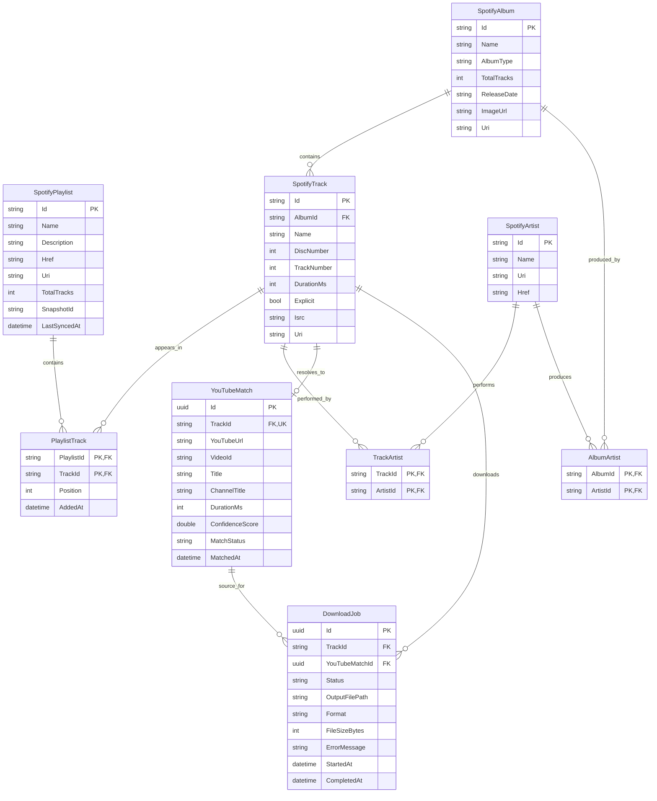
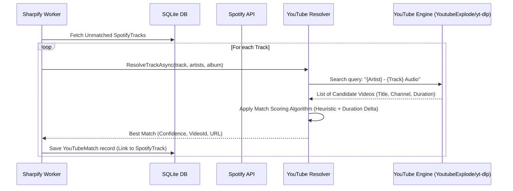
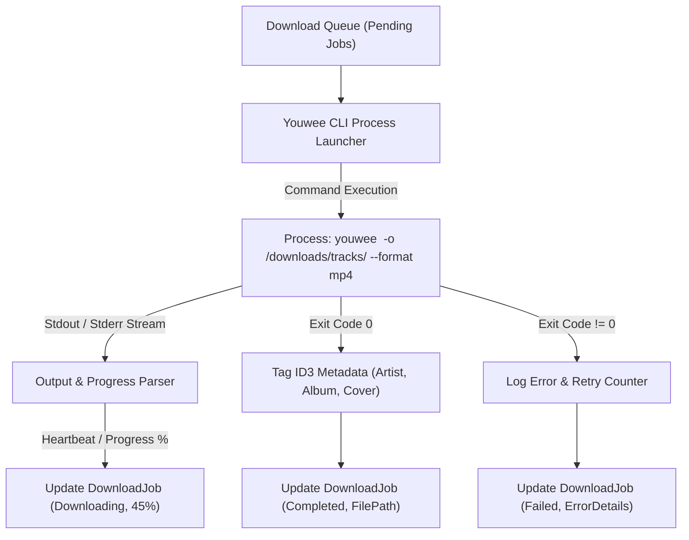
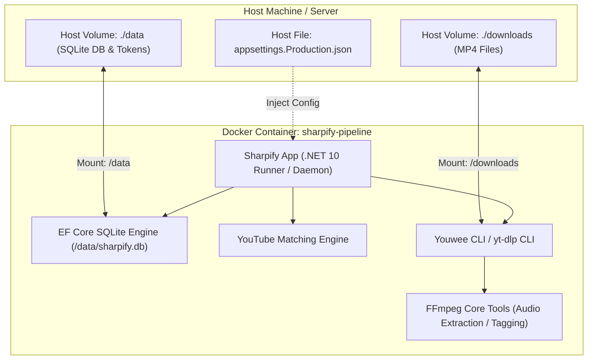

# Business Requirements Document (BRD)
## Sharpify: Spotify Sync, YouTube Matcher & Media Downloader Pipeline

---

### Document Control
- **Project Name:** Sharpify (Scrapefy)
- **Document Version:** 1.0.0
- **Status:** Draft / Proposed
- **Target Framework:** .NET 10 (C# 13 / 14)
- **Author:** Antigravity Engineering
- **Date:** September 28, 2026

---

## 1. Executive Summary

### 1.1 Background & Purpose
[Sharpify](file:///Users/manuelsaleta/Projects/Sharpify/README.md) is currently a .NET 10 console and class library client that interfaces with the Spotify Web API to authenticate users via OAuth 2.0 PKCE, inspect user libraries, and retrieve detailed playlist and track metadata.

To evolve Sharpify into an end-to-end media archival and synchronization platform, the system must bridge the gap between Spotify metadata (songs, albums, playlists) and playable local media files. This document details the architectural requirements and execution roadmap for:
1. Selecting and integrating a persistence layer (Database + ORM).
2. Querying and matching Spotify entities against YouTube to locate high-confidence video/audio URLs and persisting these mappings.
3. Integrating with the **Youwee** media downloader via CLI to convert matched YouTube URLs into high-quality MP4/audio files saved on disk.
4. Packaging the complete pipeline inside an autonomous, headless Docker container.

### 1.2 Core Objectives
- **Zero-Data-Loss Ingestion:** Reliably persist Spotify tracks, albums, playlists, and user library snapshots without re-fetching static metadata repeatedly.
- **Accurate Media Matching:** Implement an intelligent, deterministic matching engine that pairs Spotify tracks with corresponding YouTube media based on metadata similarity and duration validation.
- **Automated Media Acquisition:** Delegate media extraction to Youwee CLI (with headless fallback) to download and tag MP4 files.
- **Containerized Portability:** Enable one-command execution via Docker / Docker Compose with persistent data volumes.

---

## 2. Scope & Execution Order

Per system requirements, the project is divided into four distinct phases to be tackled sequentially:



1. **Phase 1 (Database Solution & ORM Selection):** Design the schema, evaluate and choose the database engine and ORM, implement Code-First migrations, and create the Data Access Layer.
2. **Phase 2 (YouTube Search & Entity Association):** Implement YouTube search resolution for songs, albums, and playlists, calculate match confidence scores, and store the resulting URLs alongside the corresponding entities.
3. **Phase 3 (Youwee CLI Integration & Media Storage):** Implement the process execution client for Youwee CLI to convert YouTube URLs to MP4 songs, handle download queues, track job progress, and write files to the target media directory.
4. **Phase 4 (Docker Containerization):** Construct a multi-stage Docker image packaging .NET 10, Youwee CLI, yt-dlp, and FFmpeg, along with a Docker Compose specification mounting persistent storage volumes.

---

## 3. Phase 1: Database & ORM Solution Architecture

### 3.1 Evaluation & Technology Selection

#### Database Engine Comparison

| Criteria | SQLite (Selected) | PostgreSQL | LiteDB / DocumentDB |
| :--- | :--- | :--- | :--- |
| **Footprint** | Embedded, single file (`sharpify.db`), zero server process overhead. | Requires separate service/container (`postgres:16`), memory overhead. | Embedded single file, BSON format. |
| **Containerization** | Trivial: volume mount single directory `/data/sharpify.db`. | Requires multi-container `docker-compose` setup. | Trivial volume mount. |
| **Relational Integrity** | Full ACID, foreign keys, cascading deletes, unique constraints. | Industry-standard relational engine, rich index types. | No true foreign key constraints or relational joins. |
| **Performance** | Up to 100k+ reads/sec with WAL mode; fast for personal archival. | High concurrency, excellent for multi-user web backends. | Fast for simple document lookups. |
| **EF Core Support** | First-class official provider (`Microsoft.EntityFrameworkCore.Sqlite`). | First-class official provider (`Npgsql.EntityFrameworkCore.PostgreSQL`). | Third-party or custom LINQ provider. |

**Decision:** **SQLite** with Write-Ahead Logging (WAL) is the primary default database. It keeps Sharpify lightweight, self-contained, and easily containerized without external DB dependencies. The architecture will use database abstractions so a user can switch to **PostgreSQL** by updating the connection string if desired.

#### ORM Comparison

| Criteria | Entity Framework Core 10 (Selected) | Dapper |
| :--- | :--- | :--- |
| **Type Safety & LINQ** | Full LINQ support, strongly typed queries, compile-time checks. | Raw SQL queries with typed mapping; SQL syntax runtime errors. |
| **Schema Migrations** | Built-in Code-First migrations (`dotnet ef migrations add`). | Requires manual SQL scripts or secondary tool (DbUp). |
| **Entity Graph Navigation** | Automatic relation loading (`Include(t => t.Artists).Include(t => t.YouTubeMatch)`). | Manual joins and multi-mapping boilerplate code. |
| **Change Tracking** | Automatic state tracking for inserts, updates, and batch saves. | Manual `INSERT ... ON CONFLICT DO UPDATE` queries. |

**Decision:** **Entity Framework Core 10** (`Microsoft.EntityFrameworkCore.Sqlite`). It natively handles navigation properties across tracks, albums, playlists, YouTube matches, and download jobs with zero handwritten SQL maintenance.

### 3.2 Relational Entity-Relationship Diagram (ERD)



### 3.3 Functional Requirements (Phase 1)
- **FR-1.1:** The system shall configure an EF Core `DbContext` ([`SharpifyDbContext`](file:///Users/manuelsaleta/Projects/Sharpify/src/Sharpify.Core/Data/SharpifyDbContext.cs)) supporting SQLite (default) and PostgreSQL (configurable).
- **FR-1.2:** The system shall persist full Spotify API responses (`PlayListResponse`, `SpotifyTrack`, `SpotifyAlbum`, `SpotifyArtist`) without loss of relational connections.
- **FR-1.3:** The system shall support idempotent upserts: re-syncing a playlist updates existing tracks rather than creating duplicate entries.
- **FR-1.4:** The system shall provide database migration commands executable on application startup (`Database.MigrateAsync()`) when running in containerized/headless mode.

---

## 4. Phase 2: YouTube Search, Resolution & Entity Association

### 4.1 Resolution Strategy

When a Spotify track, album, or playlist is designated for synchronization, the system resolves corresponding YouTube media:



### 4.2 Scoring & Matching Algorithm

Finding the exact music track on YouTube requires filtering out live versions, extended remixes, reaction videos, and covers unless specifically requested:

1. **Query Construction:**
   - Primary: `"{ArtistName} - {TrackTitle} (Official Audio)"`
   - Secondary Fallback: `"{ArtistName} - {TrackTitle}"`
   - With ISRC (when available): `"{ISRC}"` or `"{ArtistName} {TrackTitle}"`

2. **Scoring Factors:**
   - **Title Similarity ($S_{\text{title}} \in [0, 1]$):** Normalized Levenshtein / Token Sort Ratio comparing Spotify track title and YouTube video title.
   - **Duration Delta ($S_{\text{duration}} \in [0, 1]$):**
     $$\Delta t = | \text{Duration}_{\text{Spotify}} - \text{Duration}_{\text{YouTube}} |$$
     - $\Delta t \le 3\text{s} \implies 1.0$
     - $3\text{s} < \Delta t \le 8\text{s} \implies 0.8$
     - $8\text{s} < \Delta t \le 15\text{s} \implies 0.5$
     - $\Delta t > 15\text{s} \implies 0.0$ (High penalty to prevent 10-hour loops or full albums).
   - **Channel Credibility ($S_{\text{channel}} \in [0, 0.2]$):**
     - Bonus if channel ends in `"- Topic"` (YouTube Music official release).
     - Bonus if channel name contains the artist name or verified music badge.
   - **Negative Keyword Filter:** Penalty for terms like `"Reaction"`, `"Cover"`, `"Live at"`, `"Instrumental"` (unless the Spotify track title itself contains `"Instrumental"`).

3. **Composite Confidence Score:**
   $$\text{Confidence} = 0.5 \times S_{\text{title}} + 0.35 \times S_{\text{duration}} + 0.15 \times S_{\text{channel}}$$
   - **Confidence $\ge 0.75$:** Auto-accept match (`MatchStatus.Matched`).
   - **$0.50 \le \text{Confidence} < 0.75$:** Flag for manual verification (`MatchStatus.PendingVerification`).
   - **Confidence $< 0.50$:** Mark as unmatched (`MatchStatus.Failed`).

### 4.3 Functional Requirements (Phase 2)
- **FR-2.1:** Implement an [`IYouTubeMatchService`](file:///Users/manuelsaleta/Projects/Sharpify/src/Sharpify.Core/Services/IYouTubeMatchService.cs) resolving tracks, album tracklists, and playlists.
- **FR-2.2:** Support query execution via lightweight YouTube scrapers (`YoutubeExplode` or `yt-dlp` CLI `ytsearch1:`) without requiring paid Google API keys or exhausting restrictive daily quotas.
- **FR-2.3:** Persist the resolved YouTube URL, Video ID, Channel Title, Match Confidence, and Duration alongside the Spotify Track record in `YouTubeMatch`.
- **FR-2.4:** Support manual override CLI commands (`sharpify match --track-id <id> --url <youtube-url>`).

---

## 5. Phase 3: Youwee CLI Media Downloader Integration

### 5.1 Architecture & Process Wrapper

Youwee is an open-source media processing and download client built on Tauri, React, and `yt-dlp`. It exposes a local Command Line Interface (CLI) to queue and execute downloads with specific output folders and formats.



### 5.2 Abstraction & Headless Fallback

In a containerized environment (Docker), desktop graphical window managers (X11 / Wayland) are absent. While the Youwee CLI runs tasks headlessly, the system architecture must decouple the downloader via an interface:

- [`IMediaDownloader`](file:///Users/manuelsaleta/Projects/Sharpify/src/Sharpify.Core/Downloaders/IMediaDownloader.cs):
  - `Task<DownloadResult> DownloadAsync(DownloadRequest request, IProgress<DownloadProgress>? progress = null, CancellationToken ct = default);`
- **Primary Driver:** `YouweeCliDownloader`:
  - Executes the `youwee` binary on the host/container.
  - Passes arguments: `--url <url>`, `--output <path>`, `--format mp4` (or `--audio-only --audio-format mp4/m4a`).
- **Headless Fallback Driver:** `YtDlpCliDownloader`:
  - Direct fallback to `yt-dlp` using identical CLI flags if the Youwee GUI/CLI wrapper is not packaged in Linux headless mode.

### 5.3 Audio Metadata & Tagging Post-Processing
After the media file is saved as `.mp4` (AAC audio in MP4 container or video/audio MP4):
- Tag metadata onto the resulting file:
  - Title (`SpotifyTrack.Name`)
  - Artist (`SpotifyTrack.Artists`)
  - Album (`SpotifyAlbum.Name`)
  - Track & Disc Number
  - Release Year
  - Embedded Album Artwork (downloaded from `SpotifyAlbum.Images[0].Url`)
- Path Convention:
  `/downloads/{Artist}/{Album}/{TrackNumber:D2} - {TrackName}.mp4`

### 5.4 Functional Requirements (Phase 3)
- **FR-3.1:** Implement a non-blocking process launcher with standard output/error redirection and timeout handling.
- **FR-3.2:** Parse CLI execution logs to extract download percentage, ETA, and target output path.
- **FR-3.3:** Record download job status changes in the `DownloadJob` table (`Queued`, `Downloading`, `Completed`, `Failed`).
- **FR-3.4:** Ensure downloaded MP4 files are tagged with canonical Spotify metadata and stored in structured directories.
- **FR-3.5:** Support batch processing of whole playlists with configurable rate-limiting to prevent IP throttling.

---

## 6. Phase 4: Containerization & Deployment Architecture

### 6.1 Container Specifications

The complete solution is packaged in a self-contained Linux container based on the official Microsoft .NET runtime image.



### 6.2 Dockerfile Multi-Stage Build
1. **Build Stage (`mcr.microsoft.com/dotnet/sdk:10.0`):**
   - Restore NuGet packages.
   - Compile and publish `Sharpify.App` in `Release` configuration.
2. **Runtime Stage (`mcr.microsoft.com/dotnet/runtime:10.0-bookworm-slim`):**
   - Install system dependencies: `ca-certificates`, `ffmpeg`, `python3`, `curl`.
   - Install `yt-dlp` and `youwee` CLI executable.
   - Copy published .NET 10 binaries.
   - Configure non-root user or user with persistent storage write permissions.
   - Set environment defaults.

### 6.3 Docker Compose Integration
```yaml
services:
  sharpify:
    build:
      context: .
      dockerfile: Dockerfile
    container_name: sharpify
    restart: unless-stopped
    volumes:
      - ./data:/data
      - ./downloads:/downloads
      - ~/.sharpify:/root/.sharpify
    environment:
      - SpotifyClient__ClientId=${SPOTIFY_CLIENT_ID}
      - SpotifyClient__ClientSecret=${SPOTIFY_CLIENT_SECRET}
      - ConnectionStrings__DefaultConnection=Data Source=/data/sharpify.db
      - Storage__MediaOutputDirectory=/downloads
    command: ["dotnet", "Sharpify.App.dll", "--sync-all"]
```

---

## 7. Non-Functional Requirements (NFRs)

| ID | Category | Requirement Description |
| :--- | :--- | :--- |
| **NFR-1** | **Portability** | The solution must run identically on macOS (Apple Silicon / Intel), Linux (x86_64, aarch64), and within Docker. |
| **NFR-2** | **Resilience** | Network drops during YouTube scraping or Youwee CLI downloads must trigger exponential backoff retry policies without corrupting files. |
| **NFR-3** | **Idempotency** | Running the sync pipeline repeatedly must not re-download tracks already marked as `Completed` with valid files existing on disk. |
| **NFR-4** | **Observability** | Structured logging via `Microsoft.Extensions.Logging` (Serilog or console JSON formatter) detailing track matching scores and CLI execution outputs. |
| **NFR-5** | **Resource Constraints** | Media extraction processes must limit concurrent downloads (e.g., max 2-3 parallel jobs) to respect system CPU/RAM limits. |

---

## 8. Risk Assessment & Mitigation

| Risk | Impact | Likelihood | Mitigation |
| :--- | :--- | :--- | :--- |
| YouTube IP rate-limiting / bot detection | High | Medium | Add random jitter delays between searches; support proxy/cookie configuration for YouTube requests. |
| Youwee CLI requires GUI window dependencies on Linux | High | Medium | Implement fallback to `yt-dlp` CLI which is 100% headless and shares the underlying engine. |
| Spotify track title mismatch with YouTube video titles | Medium | High | Heuristic scoring combining Levenshtein distance, duration delta tolerance, and official Topic channel validation. |
| SQLite concurrency lock during parallel downloads | Medium | Low | Enable SQLite Write-Ahead Logging (WAL) mode and configure connection pooling. |
