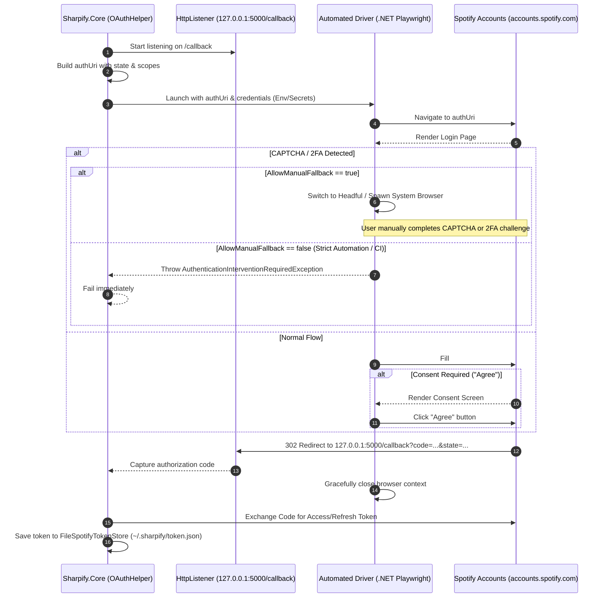

# RFC 001: Automated Spotify OAuth Authentication (Headless PoC)

## Status: Under Research & Design (Not Yet Implemented)

## 1. Overview & Problem Statement

Currently, Sharpify uses the standard OAuth 2.0 Authorization Code Flow implemented in [`SpotifyOAuthHelper.LoginAsync`](../../src/Sharpify.Core/Authentication/SpotifyOAuthHelper.cs). When a valid token is not present in [`FileSpotifyTokenStore`](../../src/Sharpify.Core/Authentication/FileSpotifyTokenStore.cs), Sharpify launches the system browser (`TryOpenBrowser`) and spins up a local `HttpListener` on `http://127.0.0.1:5000/callback` waiting for the user to manually log in and grant authorization.

### Goals & Priorities
1. **Primary Focus (Zero-Touch CLI Convenience):** Eliminate repetitive manual browser logins on development machines. Once credentials are provided (via environment variables or .NET user secrets), the CLI can complete the flow headlessly.
2. **Secondary Focus (CI/CD & Headless Environments):** Enable unattended test pipelines or headless server runners to obtain tokens without a GUI display server.

---

## 2. Authentication Flow Diagram



---

## 3. Technology Strategy & Language Evaluation

### Strategy: Pure .NET First
We will attempt a **pure .NET implementation** using `Microsoft.Playwright` first. Keeping the solution in C# avoids multi-runtime dependencies (Node.js, Python, or Ruby) and allows direct DI integration into [`Sharpify.Core`](../../src/Sharpify.Core).

### Pivot Criteria (When to use Python, Node.js, or Ruby)
If the .NET spike demonstrates any of the following blockers, we will pivot to the best external scripting tool (e.g., Node.js with `puppeteer-extra-plugin-stealth` or Python with `undetected-chromedriver`):
1. **Unresolvable Anti-Bot Detection:** C# Playwright consistently triggers Arkose Labs FunCAPTCHA on headless Chromium, even when using stealth flags, custom user agents, or persistent browser contexts.
2. **Binary Packaging Impedance:** The required .NET Playwright driver/browser installation mechanism introduces unacceptable overhead or complexity for zero-touch local CLI usage.
3. **Missing Browser Primitives:** Inability to manipulate lower-level Chrome DevTools Protocol (CDP) properties in .NET needed to emulate a human user.

| Runtime | Candidates | Pros | Cons |
| :--- | :--- | :--- | :--- |
| **.NET (Primary)** | `Microsoft.Playwright` | Single runtime, direct in-process C# code, shared types. | Lacks plug-and-play stealth ecosystem; requires Playwright browser binaries. |
| **Node.js (Fallback)** | Playwright / Puppeteer + `puppeteer-extra-plugin-stealth` | Industry standard for stealth; largest anti-bot evasion ecosystem. | Requires Node.js + npm dependencies on the host machine. |
| **Python (Fallback)** | `playwright` / `undetected-chromedriver` | Excellent anti-bot libraries (`undetected-chromedriver`); rapid prototyping. | Requires Python runtime + pip/virtualenv; multi-language repo. |
| **Ruby (Fallback)** | Ferrum / Selenium / Puppeteer-ruby | Clean scripting syntax. | Smaller community for anti-bot evasion compared to Node/Python. |

---

## 4. Configuration & Fallback Design

To support both **Zero-Touch Local CLI** (where manual approval of an occasional CAPTCHA is fine) and **Strict CI/CD** (where any manual intervention must fail fast), we will introduce two configuration parameters:

```csharp
public class AutomatedLoginOptions
{
    public const string SectionName = "AutomatedLogin";

    /// <summary>
    /// Enables automated credential submission via browser driver.
    /// </summary>
    public bool Enabled { get; set; } = false;

    /// <summary>
    /// Spotify account username / email.
    /// (Loaded via SPOTIFY_USERNAME env var or User Secrets)
    /// </summary>
    public string? Username { get; set; }

    /// <summary>
    /// Spotify account password.
    /// (Loaded via SPOTIFY_PASSWORD env var or User Secrets)
    /// </summary>
    public string? Password { get; set; }

    /// <summary>
    /// If true, detection of CAPTCHA, 2FA, or driver timeout will fallback to launching
    /// the standard system browser for manual approval.
    /// If false (e.g. CI/CD), will throw an exception and exit immediately.
    /// </summary>
    public bool AllowManualFallback { get; set; } = true;

    /// <summary>
    /// Timeout in seconds before automated login gives up.
    /// </summary>
    public int TimeoutSeconds { get; set; } = 30;
}
```

---

## 5. Implementation Phases for the Spike

### Phase 1: Standalone .NET Playwright Spike
* Target: Create an isolated prototype (or unit/integration test in `tests/Sharpify.Tests`) utilizing `Microsoft.Playwright`.
* Verify:
  1. Headful vs. headless login behavior against `accounts.spotify.com`.
  2. Element selectors: `#login-username`, `#login-password`, `#login-button`, and consent button `data-testid="auth-accept"`.
  3. Arkose Labs challenge rate when automation flags are minimized (`--disable-blink-features=AutomationControlled`, custom user-agents).
  4. Redirection to `http://127.0.0.1:5000/callback`.

### Phase 2: Pivot Evaluation
* Review Phase 1 results against the **Pivot Criteria**:
  * Did login succeed consistently without triggering CAPTCHAs?
  * If yes $\rightarrow$ proceed with .NET integration.
  * If no $\rightarrow$ test Node.js / Python stealth script prototype.

### Phase 3: Integration into Sharpify Core
* Add `AutomatedLoginOptions` to `SpotifyClientOptions`.
* Integrate the driver into `SpotifyOAuthHelper`:
  * Check if `AutomatedLogin.Enabled` is active and credentials are present.
  * Execute driver asynchronously while `HttpListener` waits.
  * Respect `AllowManualFallback`: on challenge/failure, either fall back to `TryOpenBrowser` or throw `AuthenticationInterventionRequiredException`.

---

## 6. Acceptance Criteria

- [ ] **Phase 1 Spike Complete:** Tested `Microsoft.Playwright` against Spotify login and documented anti-bot / CAPTCHA behavior.
- [ ] **Dual-Mode Fallback:** `AllowManualFallback = true` launches system browser upon CAPTCHA/2FA; `AllowManualFallback = false` fails immediately.
- [ ] **Zero-Touch Execution:** Successful end-to-end token acquisition and persistence in `FileSpotifyTokenStore` when credentials are valid and no challenge is presented.
- [ ] **Credential Security:** Credentials read exclusively from environment variables or .NET User Secrets without leaking to logs or files.
